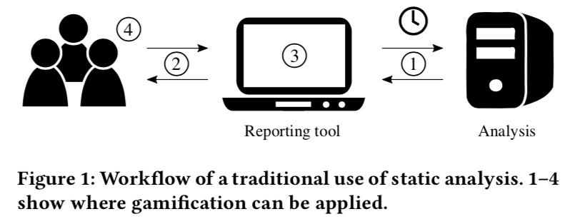
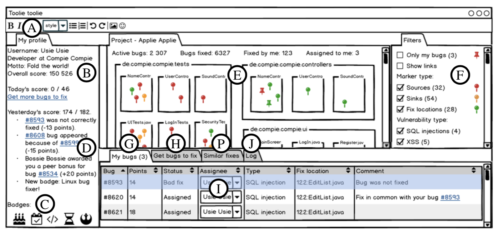
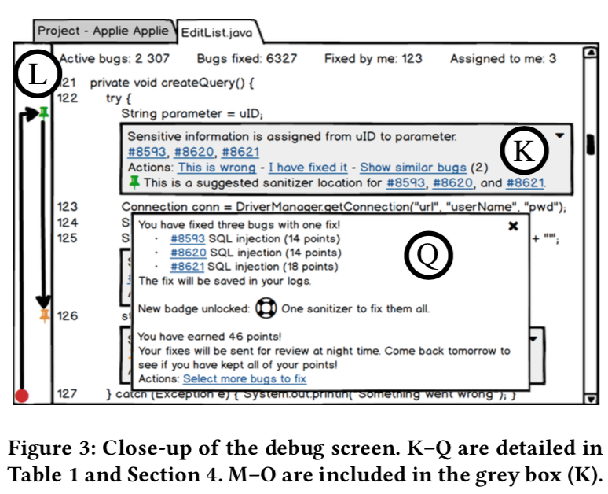

# 18 ICSE Gamifying Static Analysis 

>https://blogs.uni-paderborn.de/sse/tools/gamifying-static-analysis

To efficiently fix a warning yielded by a static analysis tool, developers have to achieve three main goals: (1) understand the code base, (2) understand the warning in the context of the code base, and (3) determine the most efficient way of fixing it. This is similar to many video games where players need (1) a good understanding of the game’s universe, (2) an understanding of the quest or level they are trying to solve, and (3) to elaborate a strategy to solve it. In both

We envision a static analysis tool which not only reports bugs, but also helps developers understand the code base, and helps them fix warnings in an engaging, motivating way. In that sense, the tool is really an intelligent code assistant. To achieve this, we propose to leverage the knowledge of game designers, and to integrate gaming elements into analysis tools to improve their user experience. Static analysis is very powerful, but the tooling is unusable, it cannot be used to its full potential. With this paper, we wish to motivate the need for creating useful, complete analysis tools.

The Self-Determination Theory (SDT) defines three innate psychological needs which influence self-motivation: competence, relatedness and autonomy [26]. In the context of video games, those needs have been found to be good predictors of enjoyment and satisfaction [27]. Competence refers to a need for a challenge and its subsequent sense of achievement (e.g., having learnt new skills). Autonomy is about the control of the player on their own actions (i.e., the degree of choice offered at each step of the game). Relatedness refers to the sense that the player’s actions have consequences on the universe of the game.

When thinking of games, concepts such as points, badges, or profiles immediately come to mind. However, it is important to remember that the goal of gamifying a system is not about making it a game but making the tool more engaging to the users, and also considering when not to gamify [5, 14]. All features of a good analysis tool should be engaging, useful (i.e., directly assist the developer in fixing bugs), and be minimally disruptive of the developer’s work [12, 16, 24]. 

1. Responsiveness: Because static analysis can take a long time to terminate, analysis tools seldom provide support for providing immediate feedback in response to a developer modification of source code. To improve this, we raise two challenges. 
   * Making the analysis responsive. 
   * Making the UI responsive. 
2. Solution-oriented communication: Analysis tools typically display information in terms of bugs (e.g., vulnerability types, severity etc.). Instead, we propose to shift the focus towards fixes, which revolves around the following three challenges. 
   1. Presenting warnings using fix information.
   2. Learning from the developer.
   3. Pacing the difficulty.
3. Clear working status: Video game UIs strive to give users a large autonomy by: (1) clearly presenting the player’s current status to help them choose their next action, and (2) providing them with intuitive actionable controls to take those actions. The UI of static analysis tools should also address those challenges. 
   1. Showing the developer’s current status. 
   2. Showing available actions.
4. Teamwork: An aspect of static analysis that is often overlooked by analysis writers is that, code can be developed collaboratively. Leveraging a group’s knowledge and experience of the tool and the code base can be very efficient 
   1. Collaborative problem-solving.  
   2. Motivating elements for collaborative work.  

