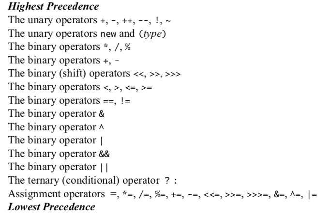
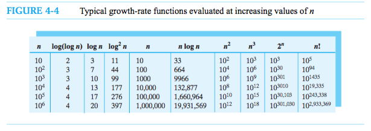
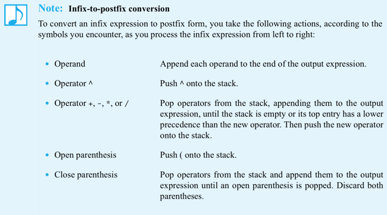
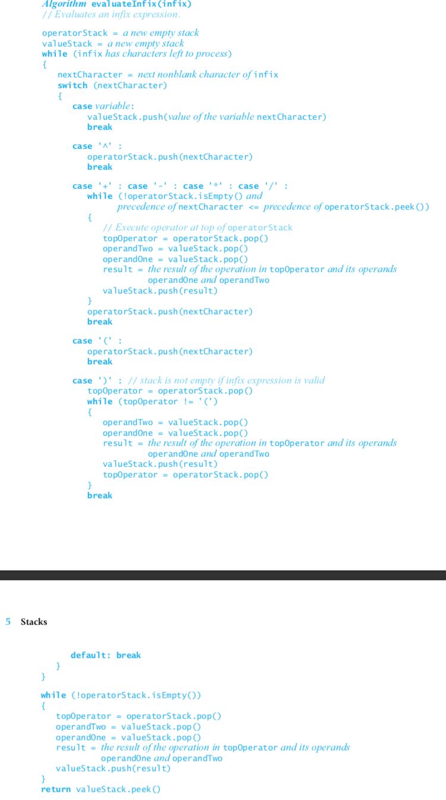

# Notes on Data Structures and Abstractions with Java

> Frank M. Carrano 

[TOC]

### Operator Precedence

When operators have equal precedence, binary operators execute in left-to-right order, and unary operators execute in right-to-left order.



### Introduction

1. ADT: a specification that describes a data set and the operations on that data.
2. Data structure: is an implementation of an ADT within a programming language.
3. Collection: is a general term for an ADT that contains a group of objects.
4. Container: is a class that implements a collection.
5. Bag: consists of an unordered collection that allows duplicates.
6. List: ordered items in a variety of ways
7. Stack|Queue: order their items chronologically
8. Dictionary: pairs of items
9. Tree: organized its entries according to some hierarchy
10. Graph: generalization of the ADT tree that focuses on the relationship among its entries instead of hierarchical organization.


### Bag

A bag is a finite collection of objects in no particular order. A bag can contain duplicate items.

Since a bag is an abstract data type, **we only describe its data and specify its operations. We do not indicate how to store the data or how to implement its operations.** Don’t think about arrays, for example. You first need to clearly know what the bag operations do: Focus on what the operations do, not on how they do them. That is, you need a detailed set of specifications before you can use a bag in a program. In fact, you should specify the bag operations before you even decide on a programming language.


**Writing Java statements that test a class’s methods will help you to fully understand the spec- ifications for the methods.** Obviously, you must understand a method before you can imple- ment it correctly. If you are also the class designer, your use of the class might help you see desirable changes to your design or its documentation. You will save time if you make these revisions before you have implemented the class. Since you must write a program that tests your implementation sometime, why not get additional benefits from the task by writing it now instead of later?

**Usining an ADT is like using a vending machine**. When you look at the front of a vending machine, you see its interface. By inserting coins and pressing buttons, you are able to make a purchase. Here are some observations that we can make about the vending machine:
● You can perform only the specific tasks that the machine’s interface presents to you.
● You must understand these tasks—that is, you must know what to do to buy a soda.
● You cannot access the inside of the machine, because a locked shell encapsulates it.
● You can use the machine even though you do not know what happens inside.
● If someone replaced the machine’s inner mechanism with an improved version, leaving the interface unchanged, you could still use the machine in the same way.


### Bag implementation use arrays

The definition for the class ArrayBag could be fairly involved. The class certainly will have quite a few methods. For such classes, you should not define the entire class and then attempt to test it. **Instead, you should identify a group of core methods to both implement and test before continu- ing with the rest of the class definition.** By leaving the definitions of the other methods for later, you can focus your attention and simplify your task. But what methods should be part of this group? In general, such methods should be central to the purpose of the class and allow reasonable testing. We sometimes will call a group of core methods a core group.

**The core methods**
● Constructors
● public boolean add(T newEntry) ● public T[] toArray()
● public boolean isFull()


```
// the cast is safe because the new array contains null entries
@SuppressWarnings("unchecked")
T[] tempBag = (T[])new Object[capacity]; // unchecked cast bag = tempBag;

To suppress an unchecked-cast warning from the compiler, you precede the flagged state- ments with the instruction
    @SuppressWarnings("unchecked")
Note that this instruction can precede only a method definition or a variable declaration.
```

An incomplete definition of a method is called a **stub**. The stub needs only to keep the syntax checker happy.

Remember that we are not required to maintain any particular order for a bag’s entries. So instead of shifting array entries after removing an entry, we can replace the entry being removed with the last entry in the array。

When a classroom is full, one way to accommodate additional students is to move to a larger room. In a similar manner, when an array becomes full, you can move its contents to a larger array. This process is called **resizing** an array.

Doubling the size of an array each time it becomes full is a typical approach.

#### Outline

```java
public class ArrayBag<T> implements BagInterface<T>{
  private T[] bag;
  private static final int DEFAUTL_CAPACITY = 25;
  private int numberOfEntries;
  
  public ArrayBag(){this(DEFAULT)}
  
  public ArrayBag(int cap){
    numberOfEntries = 0;
    @SuppressWarnings("unchecked")
    T[] tem = (T[])new Object[cap];
    bag = tem;
  }
  
  // add:
  	// check full
  	// bag[numberOfEntries] = T; num++ 
  // isFull
  	// num == bag.length
  // toArray
  	// new Object
  	// forEach assign
  // isEmpty
  	// num is 0
  // getCurrentSize()
  	// return num
  // getFrequencyOf(T)
  	// ForEach count
  // contains
  	// while(not found and has more)
  		// if equals -> return,break
  // clear
  	// not empty() -> remove()
  // remove
  	// bag[num-1] = null; num--;
  // remove(T)
  	// getIndex
  	// remove index
  // removeEntry(index)
  	// num--; bag[index] = bug[num];bug[num]=null; // change index and the last entry
  // getIndex
  	// forEach check
}
```


### Bag implementation use linked data

**Address**: each element has a number identify itself

Reference: when an element has the address of the other element, we say this element **references** that and they are **linked**.

Chain: all these linked elements form a **chain**.

Therefore, the linked data has to keep a head of the bag, which is usually the most recently added element.

#### Outline

```java
public class LinkedBag<T> implements BagInterface<T> {
  private Node firstNode; // address of the most recently element
  private int num;
  
  private class Node{
    T data;
    Node next;
  }
  // begin
  	// newNode references a new instance of Node, place data in newNode，num++
  	// firstNode = address of newNode
  // add
  	// newNode references a new instance of Node, place data in newNode, link to firstNode
  	// firstNode = address of newNode,num++
  // toArray | getFrequencyOf | contains
  	// while -> from firstNode
  // remove
  	// firstNode = firstNode.next, num--
  // remove(T)
  	// locate node N, replace with firstNode, remove()
  // 
}
```


### The efficiency of algorithms

**Complexity** : an algorithm has both time and space requirements. The process of measuring the complexity of algorithms is called analysis of algorithms. Your measure of the complexity of an algorithm should be easy to compute, certainly easier than implementing the algorithm. You should express this measure in terms of the size of the prob- lem. This problem size is the number of items that an algorithm processes. The value of the function is said to be directly proportional to the time requirement. Such a function is called a growth-rate function because it measures how an algo- rithm’s time requirement grows as the problem size grows.

An algorithm’s **basic operation** is the most significant contributor to its total time requirement. 



Algorithm A has a time requirement proportional to n, we say that A is O(n). We call this notation Big Oh since it uses the capital letter O. We read O(n) as either “Big Oh of n” or “order of at most n.”

In simple terms, f(n) is O(g(n)) means that c x g(n) provides an upper bound on f(n)’s growth rate when n is large enough. For all data sets of a sufficient size, the algorithm will always require fewer than c x g(n) basic operations.

### Stack

The ADT stack organizes its entries according to the order in which they were added. All additions are to one end of the stack called the top. The top entry—that is, the entry at the top—is thus the newest item among the items currently in a stack.

#### Outline

```java
public interface StackInterface<T> {
  void push(T);
  T pop();
  T peek();
  boolean isEmpty();
  void clear();
}
```

#### Check balanced delimiters


#### Infix to postfix

Notice that the **order of the operands a, b, and c** in an infix expression is the same in the corre- sponding postfix expression. **One way to determine where the operators should appear in a postfixexpression begins with a fully parenthesized infix expression.** For example, we write the infix expres-sion (a + b) * c as ((a + b) * c). By adding parentheses, we remove the expression’s dependence on therules of operator precedence. Each operator is now associated with a pair of parentheses. We nowmove each operator to the right so that it appears immediately before its associated close parenthesisto get ((a b +) c *). Finally, we remove the parentheses to obtain the postfix expression a b + c *.

When we encounter an operand, we place it at the end of the new expression that we are creating. When we encounter an operator, we must save it until we determine where in the output expression it belongs. We saved the operator until we processed its second operand. In general, wehold the operator in a stack at least until we compare its precedence with that of the next operator. We need to distinguish between operators that have a left-to-right association—namely +, -, *, and /—and exponentiation, which has a right-to-left association.

Parentheses override the rules of operator precedence. We always push an open parenthesis onto the stack. Once it is in the stack, we treat an open parenthesis as an operator with the lowest precedence. That is, any subsequent operator will get pushed onto the stack. When we encounter a close parenthesis, we pop operators from the stack and append them to the forming postfix expression until we pop an open parenthesis. The algorithm continues with no parentheses added to the postfix expression.




#### Evaluate Postfix


#### Evaluate Infix



### Stack Implementations

#### Linked

```
public class LinkedStack<T> implements StackInterface<T>{
  private Node topNode;
  // constructor
  // push(T)
  	// newNode; topNode = newNode
  // T peek()
  	// topNode#data
  // T pop()
  	// tem = peek();topNode = topNode#next
}
```


### Recursion

Two problem-solving processes involve repetition; they are called iteration and recursion. In fact, most programming languages provide two kinds of repetitive constructs, iterative and recursive.

#### Questions to answer when designing a recursive solution

• What part of the solution can you contribute directly?
• What smaller but identical problem has a solution that, when taken with your contribution,
provides the solution to the original problem?
• When does the process end? That is, what smaller but identical problem has a known
solution, and have you reached this problem, or base case?

**The definition of a recursive method must contain logic that involves an input—often a parameter—to the method and leads to different cases.** One or more of these cases are base cases, or stopping cases, because they provide a solution that does not require recursion. One or more cases include a recursive invocation of the method that takes a step toward a base case by solving a “smaller” version of the task performed by the method.

A recursive method uses more memory than an iterative method, in general, because each recursive call generates an activation record.

#### Tower of Hanoi


#### Tail recursion

Tail recursion occurs when the last action performed by a recursive method is a recursive call. 

#### Indirect recursion

Some recursive algorithms make their recursive calls indirectly. For example, we might have the following chain of events: Method A calls Method B, Method B calls Method C, and Method C calls Method A. Such recursion—called indirect recursion—is more difficult to understand and trace, but it does arise naturally in certain applications.

### Queue, Deque, Priority Queue 

Like a stack, the ADT queue organizes its entries according to the order in which they were added. But while a stack has a last-in, first-out behavior, a queue exhibits a first-in, first-out, or **FIFO**, behavior.

The operation that adds an entry to a queue is traditionally called enqueue (pronounced “N-Q”). The operation to remove an entry is dequeue (pronounced “D-Q”). The operation that retrieves the queue’s front entry is called getFront. 

```java
public interface QueueInterface<T> {
  public void enqueue(T newEntry);
  public T dequeue();
  public T getFront();
  public boolean isEmpty();
  public void clear();
}
```

#### Double-ended queue (Deque "deck")

```java
public interface DequeInterface<T> {
  public void addToFront(T newEntry);
  public void addToBack(T newEntry);
  public T removeFront();
  public T removeBack();
  public T getFront();
  public T getBack();
  public boolean isEmpty();
  public void clear();
}
```


#### Priority Queue

The ADT priority queue organizes objects according to their priorities. Exactly what form a prior- ity takes depends on the nature of the object. 

```java
public interface PriorityQueueInterface<T extends Comparable<? super T>> {
  public void add(T newEntry);
  public T remove();
  public T peek();
  public boolean isEmpty();
  public int getSize();
  public void clear();
}
```


### Queue implementations

#### Queue

Adding a tail reference—an external reference to the last node in the chain—is one approach to this problem and is the one we will take here.

```java
public class LinkedQueue<T> implements QueueInterface<T> {
  private Node firstNode;
  private Node lastNode;
  
  // enqueue(T)
  	// newNode;
  	// if empty -> firstNode = newNode; else lastNode#next = newNode
  	// lastNode = newNode
  // getFront()
  	// notEmpt() -> firstNode#data; null
  // dequeue()
  	// front = firstNode#data, firstNode= firsNode#next
  // isEmpty()
  	// firstNode and lastNode both null
}
```

#### Deque

Doubly linked chain

```java
public class DLNode {
  private T data;
  private DLNode next;
  private DLNode previous;
}

public class LinkedDeque<T> implements DequeInterface<T> {
  private DLNode first;
  private DLNode last;
  // addToBack
  	// newNode(last, newEntry, null)
  	// empty? first = newNode: last#next=new
  	// last = new
  // addToFront
  	// newNode(null, newEntry, first)
  	// empty? last = newNode : first#pre = newNode
  	// first = newNode
  // removeFront
  	// empty -> null
  	// front = first#data
  	// first = first#next
  		// first null? last = null : first#pre = null
  // removeBack
  	// empty -> null
  	// back = last#data
  	// last = last#prev
  		// last null ? first = null : last#next = null
}
```

