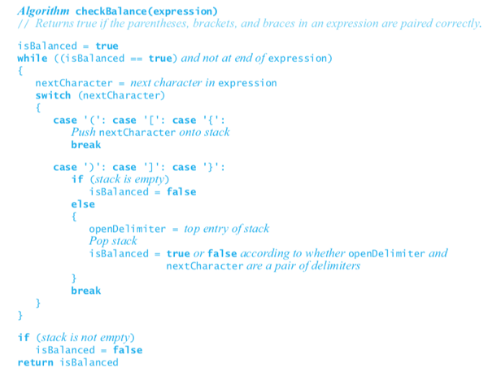
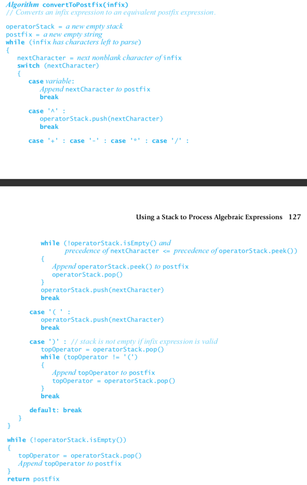
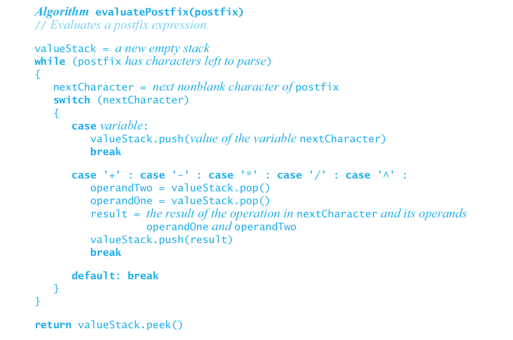
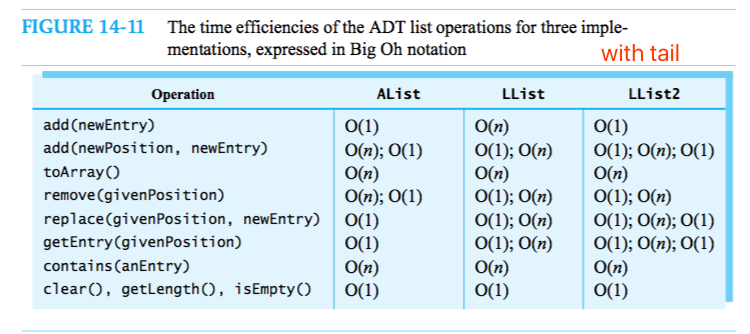
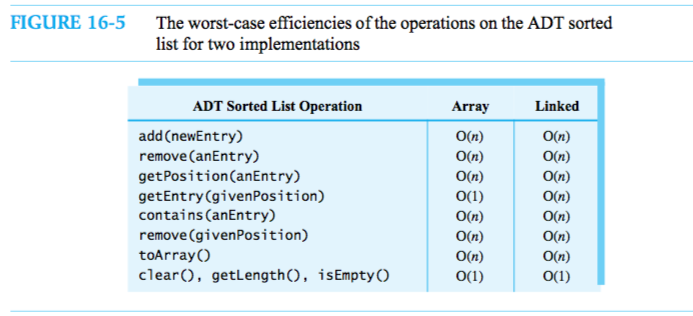
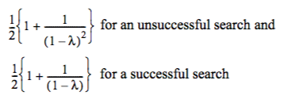
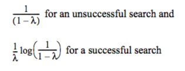
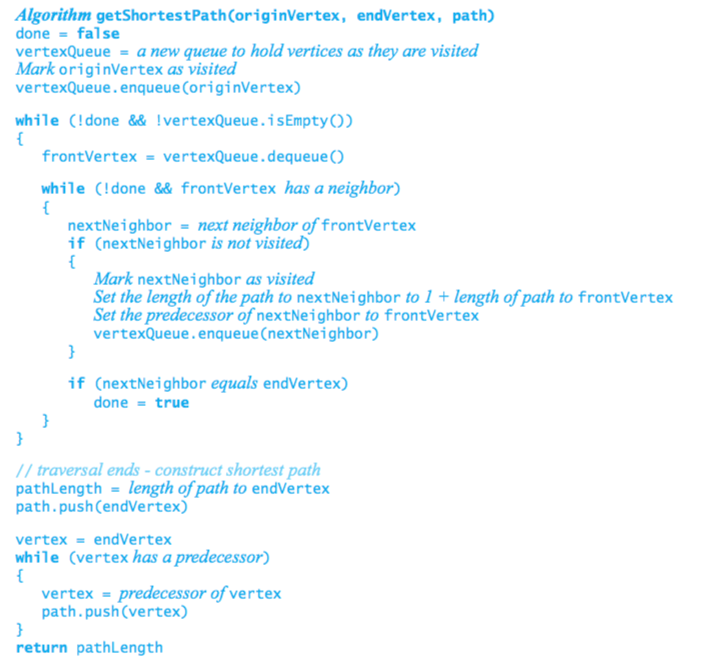
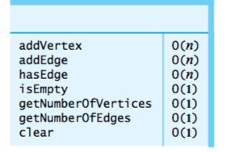

# Notes on Data Structures and Abstractions with Java

> Frank M. Carrano 

[TOC]

### Operator Precedence

When operators have equal precedence, binary operators execute in left-to-right order, and unary operators execute in right-to-left order.


### Introduction

1. ADT: a specification that describes a data set and the operations on that data.
2. Data structure: is an implementation of an ADT within a programming language.
3. Collection: is a general term for an ADT that contains a group of objects.
4. Container: is a class that implements a collection.
5. Bag: consists of an unordered collection that allows duplicates.
6. List: ordered items in a variety of ways
7. Stack|Queue: order their items chronologically
8. Dictionary: pairs of items
9. Tree: organized its entries according to some hierarchy
10. Graph: generalization of the ADT tree that focuses on the relationship among its entries instead of hierarchical organization.


### Bag

A bag is a finite collection of objects in no particular order. A bag can contain duplicate items.

Since a bag is an abstract data type, **we only describe its data and specify its operations. We do not indicate how to store the data or how to implement its operations.** Don’t think about arrays, for example. You first need to clearly know what the bag operations do: Focus on what the operations do, not on how they do them. That is, you need a detailed set of specifications before you can use a bag in a program. In fact, you should specify the bag operations before you even decide on a programming language.


**Writing Java statements that test a class’s methods will help you to fully understand the spec- ifications for the methods.** Obviously, you must understand a method before you can imple- ment it correctly. If you are also the class designer, your use of the class might help you see desirable changes to your design or its documentation. You will save time if you make these revisions before you have implemented the class. Since you must write a program that tests your implementation sometime, why not get additional benefits from the task by writing it now instead of later?

**Usining an ADT is like using a vending machine**. When you look at the front of a vending machine, you see its interface. By inserting coins and pressing buttons, you are able to make a purchase. Here are some observations that we can make about the vending machine:
● You can perform only the specific tasks that the machine’s interface presents to you.
● You must understand these tasks—that is, you must know what to do to buy a soda.
● You cannot access the inside of the machine, because a locked shell encapsulates it.
● You can use the machine even though you do not know what happens inside.
● If someone replaced the machine’s inner mechanism with an improved version, leaving the interface unchanged, you could still use the machine in the same way.


### Bag implementation use arrays

The definition for the class ArrayBag could be fairly involved. The class certainly will have quite a few methods. For such classes, you should not define the entire class and then attempt to test it. **Instead, you should identify a group of core methods to both implement and test before continu- ing with the rest of the class definition.** By leaving the definitions of the other methods for later, you can focus your attention and simplify your task. But what methods should be part of this group? In general, such methods should be central to the purpose of the class and allow reasonable testing. We sometimes will call a group of core methods a core group.

**The core methods**
● Constructors
● public boolean add(T newEntry) ● public T[] toArray()
● public boolean isFull()


```
// the cast is safe because the new array contains null entries
@SuppressWarnings("unchecked")
T[] tempBag = (T[])new Object[capacity]; // unchecked cast bag = tempBag;

To suppress an unchecked-cast warning from the compiler, you precede the flagged state- ments with the instruction
    @SuppressWarnings("unchecked")
Note that this instruction can precede only a method definition or a variable declaration.
```

An incomplete definition of a method is called a **stub**. The stub needs only to keep the syntax checker happy.

Remember that we are not required to maintain any particular order for a bag’s entries. So instead of shifting array entries after removing an entry, we can replace the entry being removed with the last entry in the array。

When a classroom is full, one way to accommodate additional students is to move to a larger room. In a similar manner, when an array becomes full, you can move its contents to a larger array. This process is called **resizing** an array.

Doubling the size of an array each time it becomes full is a typical approach.

#### Outline

```java
public class ArrayBag<T> implements BagInterface<T>{
  private T[] bag;
  private static final int DEFAUTL_CAPACITY = 25;
  private int numberOfEntries;
  
  public ArrayBag(){this(DEFAULT)}
  
  public ArrayBag(int cap){
    numberOfEntries = 0;
    @SuppressWarnings("unchecked")
    T[] tem = (T[])new Object[cap];
    bag = tem;
  }
  
  // add:
  	// check full
  	// bag[numberOfEntries] = T; num++ 
  // isFull
  	// num == bag.length
  // toArray
  	// new Object
  	// forEach assign
  // isEmpty
  	// num is 0
  // getCurrentSize()
  	// return num
  // getFrequencyOf(T)
  	// ForEach count
  // contains
  	// while(not found and has more)
  		// if equals -> return,break
  // clear
  	// not empty() -> remove()
  // remove
  	// bag[num-1] = null; num--;
  // remove(T)
  	// getIndex
  	// remove index
  // removeEntry(index)
  	// num--; bag[index] = bug[num];bug[num]=null; // change index and the last entry
  // getIndex
  	// forEach check
}
```


### Bag implementation use linked data

**Address**: each element has a number identify itself

Reference: when an element has the address of the other element, we say this element **references** that and they are **linked**.

Chain: all these linked elements form a **chain**.

Therefore, the linked data has to keep a head of the bag, which is usually the most recently added element.

#### Outline

```java
public class LinkedBag<T> implements BagInterface<T> {
  private Node firstNode; // address of the most recently element
  private int num;
  
  private class Node{
    T data;
    Node next;
  }
  // begin
  	// newNode references a new instance of Node, place data in newNode，num++
  	// firstNode = address of newNode
  // add
  	// newNode references a new instance of Node, place data in newNode, link to firstNode
  	// firstNode = address of newNode,num++
  // toArray | getFrequencyOf | contains
  	// while -> from firstNode
  // remove
  	// firstNode = firstNode.next, num--
  // remove(T)
  	// locate node N, replace with firstNode, remove()
  // 
}
```


### The efficiency of algorithms

**Complexity** : an algorithm has both time and space requirements. The process of measuring the complexity of algorithms is called analysis of algorithms. Your measure of the complexity of an algorithm should be easy to compute, certainly easier than implementing the algorithm. You should express this measure in terms of the size of the prob- lem. This problem size is the number of items that an algorithm processes. The value of the function is said to be directly proportional to the time requirement. Such a function is called a growth-rate function because it measures how an algo- rithm’s time requirement grows as the problem size grows.

An algorithm’s **basic operation** is the most significant contributor to its total time requirement. 


Algorithm A has a time requirement proportional to n, we say that A is O(n). We call this notation Big Oh since it uses the capital letter O. We read O(n) as either “Big Oh of n” or “order of at most n.”

In simple terms, f(n) is O(g(n)) means that c x g(n) provides an upper bound on f(n)’s growth rate when n is large enough. For all data sets of a sufficient size, the algorithm will always require fewer than c x g(n) basic operations.

### Stack

The ADT stack organizes its entries according to the order in which they were added. All additions are to one end of the stack called the top. The top entry—that is, the entry at the top—is thus the newest item among the items currently in a stack.

#### Outline

```java
public interface StackInterface<T> {
  void push(T);
  T pop();
  T peek();
  boolean isEmpty();
  void clear();
}
```

#### Check balanced delimiters



#### Infix to postfix

Notice that the **order of the operands a, b, and c** in an infix expression is the same in the corre- sponding postfix expression. **One way to determine where the operators should appear in a postfixexpression begins with a fully parenthesized infix expression.** For example, we write the infix expres-sion (a + b) * c as ((a + b) * c). By adding parentheses, we remove the expression’s dependence on therules of operator precedence. Each operator is now associated with a pair of parentheses. We nowmove each operator to the right so that it appears immediately before its associated close parenthesisto get ((a b +) c *). Finally, we remove the parentheses to obtain the postfix expression a b + c *.

When we encounter an operand, we place it at the end of the new expression that we are creating. When we encounter an operator, we must save it until we determine where in the output expression it belongs. We saved the operator until we processed its second operand. In general, wehold the operator in a stack at least until we compare its precedence with that of the next operator. We need to distinguish between operators that have a left-to-right association—namely +, -, *, and /—and exponentiation, which has a right-to-left association.

Parentheses override the rules of operator precedence. We always push an open parenthesis onto the stack. Once it is in the stack, we treat an open parenthesis as an operator with the lowest precedence. That is, any subsequent operator will get pushed onto the stack. When we encounter a close parenthesis, we pop operators from the stack and append them to the forming postfix expression until we pop an open parenthesis. The algorithm continues with no parentheses added to the postfix expression.




#### Evaluate Postfix




#### Evaluate Infix


### Stack Implementations

#### Linked

```
public class LinkedStack<T> implements StackInterface<T>{
  private Node topNode;
  // constructor
  // push(T)
  	// newNode; topNode = newNode
  // T peek()
  	// topNode#data
  // T pop()
  	// tem = peek();topNode = topNode#next
}
```


### Recursion

Two problem-solving processes involve repetition; they are called iteration and recursion. In fact, most programming languages provide two kinds of repetitive constructs, iterative and recursive.

#### Questions to answer when designing a recursive solution

• What part of the solution can you contribute directly?
• What smaller but identical problem has a solution that, when taken with your contribution,
provides the solution to the original problem?
• When does the process end? That is, what smaller but identical problem has a known
solution, and have you reached this problem, or base case?

**The definition of a recursive method must contain logic that involves an input—often a parameter—to the method and leads to different cases.** One or more of these cases are base cases, or stopping cases, because they provide a solution that does not require recursion. One or more cases include a recursive invocation of the method that takes a step toward a base case by solving a “smaller” version of the task performed by the method.

A recursive method uses more memory than an iterative method, in general, because each recursive call generates an activation record.

#### Tower of Hanoi


#### Tail recursion

Tail recursion occurs when the last action performed by a recursive method is a recursive call. 

#### Indirect recursion

Some recursive algorithms make their recursive calls indirectly. For example, we might have the following chain of events: Method A calls Method B, Method B calls Method C, and Method C calls Method A. Such recursion—called indirect recursion—is more difficult to understand and trace, but it does arise naturally in certain applications.

### Queue, Deque, Priority Queue 

Like a stack, the ADT queue organizes its entries according to the order in which they were added. But while a stack has a last-in, first-out behavior, a queue exhibits a first-in, first-out, or **FIFO**, behavior.

The operation that adds an entry to a queue is traditionally called enqueue (pronounced “N-Q”). The operation to remove an entry is dequeue (pronounced “D-Q”). The operation that retrieves the queue’s front entry is called getFront. 

```java
public interface QueueInterface<T> {
  public void enqueue(T newEntry);
  public T dequeue();
  public T getFront();
  public boolean isEmpty();
  public void clear();
}
```

#### Double-ended queue (Deque "deck")

```java
public interface DequeInterface<T> {
  public void addToFront(T newEntry);
  public void addToBack(T newEntry);
  public T removeFront();
  public T removeBack();
  public T getFront();
  public T getBack();
  public boolean isEmpty();
  public void clear();
}
```


#### Priority Queue

The ADT priority queue organizes objects according to their priorities. Exactly what form a prior- ity takes depends on the nature of the object. 

```java
public interface PriorityQueueInterface<T extends Comparable<? super T>> {
  public void add(T newEntry);
  public T remove();
  public T peek();
  public boolean isEmpty();
  public int getSize();
  public void clear();
}
```


### Queue implementations

#### Queue

Adding a tail reference—an external reference to the last node in the chain—is one approach to this problem and is the one we will take here.

```java
public class LinkedQueue<T> implements QueueInterface<T> {
  private Node firstNode;
  private Node lastNode;
  
  // enqueue(T)
  	// newNode;
  	// if empty -> firstNode = newNode; else lastNode#next = newNode
  	// lastNode = newNode
  // getFront()
  	// notEmpt() -> firstNode#data; null
  // dequeue()
  	// front = firstNode#data, firstNode= firsNode#next
  // isEmpty()
  	// firstNode and lastNode both null
}
```

#### Deque

Doubly linked chain

```java
public class DLNode {
  private T data;
  private DLNode next;
  private DLNode previous;
}

public class LinkedDeque<T> implements DequeInterface<T> {
  private DLNode first;
  private DLNode last;
  // addToBack
  	// newNode(last, newEntry, null)
  	// empty? first = newNode: last#next=new
  	// last = new
  // addToFront
  	// newNode(null, newEntry, first)
  	// empty? last = newNode : first#pre = newNode
  	// first = newNode
  // removeFront
  	// empty -> null
  	// front = first#data
  	// first = first#next
  		// first null? last = null : first#pre = null
  // removeBack
  	// empty -> null
  	// back = last#data
  	// last = last#prev
  		// last null ? first = null : last#next = null
}
```

### Lists

```java
public interface ListInterface<T> {
  public void add(T newEntry);
  public boolean add(int pos, T newEntry);
  public T remove(int pos);
  public void clear();
  public boolean replace(int pos, T newEntry);
  public T getEntry(int pos);
  public boolean contains(T anEntry);
  public int getLength();
  public boolean isEmpty();
  public T[] toArray();
}
```

### Lists implementation as Arrays

```java
public class AList<T> implements ListInterface<T> {
  private T[] list:
  private int num;
  // constructor
  
  // ensureCapacity
  	// if num == list.length
  		// list = Arrays.copyof(list, 2*list.length)
  // makeRoom(pos)
  	// check pos; nIndex = pos -1;
  	// for lastIndex to nIndex -> list[index+1] = list[index]
  // removeGap(pos)
  	// check pos; rIndex = pos-1;
  	// for rIndex to lastIndex -> list[index] = list[index+1]
  
  // add(T)
  	// ensureCapacity();
  	// list[num] = T
  	// num++;
  // toArray
  	// build array
  // add(pos, T)
  	// check pos; ensureCap; makeRoom(pos),list[pos-1]=T;num++
  // remove(pos)
  	// check pos; result = list[pos-1];
  	// removeGap(pos);num--
  // replace | getEntry ==> easy
  // contains
  	// for to check
}
```

### Lists implementation as Linked Data

```java
public class LList<T> implements ListInterface<T> {
  private Node first;
  private Node last;
  private int num;
  // getNodeAt(pos)
  	// check pos
  	// for counter=1 to pos; currentNode = currentNode#next; return currentNode
  
  // add(T)
  	// if empty -> first = last = newNode
  	// else -> last#next=newNode; last = newNode
  	// num++
  // add(pos, T)
  	// check pos
  	// pos = 1; newNode#next = first;first = newNode
  	// pos !=1;
  		//bef=getNodeAt(pos); 	
  		//aft=nodeBefore#next;
  		//bef#next=newNode;newNode#nex=aft
  	// num++
  // isEmpty()
  	// check num
  // remove(pos)
  	// check pos;
  	// pos = 1; first = first#next;
  	// pos !=1;
  		// bef = getNodeAt(pos-1);rmv = bef#next;aft=rmv#next
  		// bef#next=aft
  	// num--
  // replace(pos, T)
  	// node = getNodeAt(pos); node#data=T
  // getEntry
  	// node = getNodeAt(pos); node#data
  // contains(T)
  	// while
  
}
```



### Iterators

An iterator is an object that traverses a collection of data. 

Notice that the previous loop is at the client level, since it uses the ADT operation getEntry to access the list. For an array-based implementation of the list, getEntry can retrieve the desired array entry directly and quickly. But if a chain of linked nodes represents the list’s entries, getEntry must move from node to node until it locates the desired one. For example, to retrieve the nth entry in the list, getEntry would begin at the first node in the chain and then move to the second node, the third node, and so on until it reached the nth node. At the next repetition of the loop, getEntry would retrieve the n + 1st entry in the list by beginning again at the first node in the chain and stepping from node to node until it reached the n + 1st node. This wastes time.

```java
public interface ListWithIteratorInterface<T> extends ListInterface<T> {
  public Iterator<T> getIterator();
}

public class LinkedListWithIterator<T> implements ListWithIteratorInterface<T> {
  public Iterator<T> getIterator() {
	return new IteratorForLinkedList(); 
  } // end getIterator

  private class IteratorForLinkedList implements Iterator<T> {
    private Node nextNode;
    private IteratorForLinkedList() {
      nextNode = firstNode;
    }
    // other methods
    // public T next()
    	// nextNode = nextNode#next
    	// return nextNode#data
    // public boolean hasNext()
    	// nextNode != null
  }
}
```

For array-based, inner class has `nextIndex` and `wasNextCalled` for index and remove operation.

Both separate class iterators and inner class iterators enable us to have several distinct iterations of a data collection in progress at the same time. Because inner class iterators have direct access to the structure containing the ADT’s data, they can execute faster than separate class iterators, and so are usually preferable.

### Sorted List

```java
public interface SortedListInterface<T extends Comparable<? super T>> {
  public void add(T nEntry);
  public boolean remove(T anEntry);
  public int getPosition(T anEntry);
  public T getEntry(int givenPosition);
  public boolean contains(T anEntry); 
  public T remove(int givenPosition); 
  public void clear();
  public int getLength();
  public boolean isEmpty();
  public T[] toArray();
}
```

```java
public class SortedLinkedList<T extends Comparable<? super T>> implements SortedListInterface<T> {
  private Node first;
  private int num;
  // getNodeBef(e)
  	// while(cur!=null && e.compareTo(cur) > 0)
  		// bef = cur;cur=cur#next
  // add
  	// newNode; bef=getNodeBef(newNode)
  	// if empty -> new#next(first); first=newNode
  	// else -> aft=bef#next;new#next=aft;bef#next=newNode
  	// num++
}
```



### Dictionaries

The dictionary, map, table contains entries that each have two parts: keyword and value.

```java
public interface DictionaryInterface<K, V> {
  public V add(K key, V value);
  public V remove(K key);
  public V getValue(K key);
  public boolean contains(K key);
  public Iterator<K> getKeyIterator();
  public Iterator<V> getValueIterator();
  public boolean isEmpty();
  public int getSize();
  public void clear();
}
```

The simplest way to specify white space and punctuation as delimiters is to use the notation \W, since it represents any character other than a letter, digit, or underscore. We then write useDelimiter’s argument as "\\W+". Remember that we must duplicate the backslash to distinguish the notation from an escape character. The plus sign means one or more occurrences of. Thus, the statement
             dataFile.useDelimiter("\\W+");
sets the delimiters to one or more occurrences of punctuation, white-space characters, and some other characters that will not occur in our data.

### Dictionary Implementation

```java
private class Entry<S, T> {
  private S key; 
  private T value;
}
public class ArrayDictionary<K, V> implements DictionaryInterface<K, V> {
  private Entry<K, V>[] dictionary; // array of unsorted entries 
  private int numberOfEntries;
  private final static int DEFAULT_CAPACITY = 25;

  // localIndex(k)
  	// while -> equals
  
  // add(k,v)
  	// key=localIndex(k)
  	// key < num -> dic[key]#data=v
  	// else -> dic[num] = new Entry(k,v)
  	// num++
  // remove
  	// exist -> index, delete index, move last here
  	// not -> 
}
```


### Hashing

This chapter introduces a technique called hashing that ideally can result in O(1) search times. Hashing can be an excellent choice for implementing a dictionary when searching is the primary task. But as good as hashing can be, it is not always appropriate. For example, hashing cannot provide a traversal of the search keys in sorted order.

Hashing is a technique that determines this index using only an entry’s search key, without searching. The array itself is called a hash table.

A hash function takes a search key and produces the integer index of an element in the hash table. This array element is where you would either store or look for the search key’s associated value.

We say that the telephone number—that is, the search key—maps, or hashes, to the index i. This index is called a hash index. Sometimes we will say that the search key maps, or hashes, into the table location at the index i.

**Typical hashing:** 
**Convert** the search key to an integer called the **hash code** and **Compress** the hash code into the range of indices for the hash table. Typical hash functions are not perfect, because they can allow more than one search key to map into a single index, causing a collision in the hash table.

The hash function that the algorithm getHashIndex describes is not a perfect hash function when tableSize is less than 10,000. Since 10,000 telephone numbers map into tableSize indices, some telephone numbers will map into the same index. We call such an occurrence a collision. 

**Hash Functions**: Any function can be a hash function if it produces an integer that is suitable as an array index. But a good function should - Minimize collisions and Be fast to compute

**Guidelines for the method hashCode**
* If a class overrides the method equals, it should override hashCode.
* If the method equals considers two objects equal, hashCode must return the same
  value for both objects.
* If you call an object’s hashCode more than once during the execution of a program,
  and if the object’s data remains the same during this time, hashCode must return the
  same hash code.
* An object’s hash code during one execution of a program can differ from its hash
  code during another execution of the same program.


**Hash code for a string**: Specifically, if the string s has n charac- ters, let ui be the Unicode value for the ith character in s (i is zero for the first character). Then the hash code can have the form, (u_0g^n-1 + ... + u_n-1), where g is positive constant.

**Hash code for a primitive type**: use int or manipulate their internal binary representations. Instead of ignoring a part of a long search key, divide it into several pieces. Then combine the pieces by using either addition or a bit-wise boolean operation such as exclusive or. This pro- cess is called **folding**.

The most common way to scale an integer so that it lies within a given range of values is to use Java’s % operator. So, n should equal the size of the hash table, but not any n will do. For example, if n is even, c % n has the same parity as c—that is, if c is even, c % n is even; if c is odd, c % n is odd. If the hash codes are biased toward either even or odd values (and note that hash codes based on mem- ory addresses are typically even), the indices to the hash table will have the same bias. Instead of a uniform distribution of indices, you will leave out the indices of many table locations if n is even. Thus, n—**the size of the hash table—always should be an odd number**. **When n is a prime number**—one that is divisible only by 1 and itself—c % n provides values that are distributed throughout the index range 0 through n - 1. Prime numbers—with the excep- tion of 2—are odd.

```java
private int getHashIndex(K key) {
  int hashIndex = key.hashCode() % hashTable.length; 
  if (hashIndex < 0)
    hashIndex = hashIndex + hashTable.length; 
  return hashIndex;
}
```

#### **Resolving Collisions** : 

When adding to a dictionary, if your hash function maps a search key into a location in the hash table that is already in use, you need to find another spot for the search key’s value. 

* Use another location in the hash table. Finding an unused, or open, location in the hash table is called **Open addressing**.

  * Locating an open location in the hash table is called **probing**, and various probing techniques are possible. With **linear probing**, if a collision occurs at hashTable[k], we see whether hashTable[k + 1] is available. The table locations that we consider in this search make up the probe sequence.  ===> additions that collide. Collisions that are resolved with linear probing cause groups of consecutive locations in the hash table to be occupied. Each group is called a **cluster**, and the phenomenon is known as primary clustering. 

    

  * You can avoid primary clustering by changing the probe sequence that you use to resolve a colli- sion. As we discussed in the previous section, if a given search key hashes to index k, linear prob- ing looks at the consecutive locations beginning at index k. **Quadratic probing**, on the other hand, considersthelocationsatindicesk+j2 forj≥0—thatis,itusestheindicesk,k+1,k+4,k+9,and so on. 

    

  * **Double hashing** : Double hashing uses a second hash function to compute these increments in a key-dependent way. In this way, double hashing avoids both pri- mary and secondary clustering.

    

  * **Problems**: Recall that only empty locations contain null. Frequent additions and removals can cause every location in the hash table to reference either a current entry or a former entry. That is, a hash table might have no location that contains null, regardless of how many or how few entries are actually in the dictionary. If this happens, our approach to searching a probe sequence will not work. Instead, every unsuccessful search can end only after considering every location in the hash table. Also, detecting the end of the search will be somewhat more involved and costly than simply looking for null.

* Change the structure of the hash table so that each array location can represent more than one value. Such a location is called a **bucket**. Anytime a new search key maps into a particular location, you simply place the key and its associated value in the bucket, much as we did with open addressing. **Either a linked implementation of a list or a chain of linked nodes** is a reasonable choice for a bucket, since memory is allocated to the bucket only as needed. Notice that a node must ref- erence the search key so that you can locate it later when you search the chain. Resolving colli- sions by using buckets that are linked chains is called **separate chaining**.


  #### Efficiency of Hashing

Resolving a collision takes time and thus causes the dictionary operations to be slower than an O(1) operation. As a hash table fills, collisions occur more often, decreasing performance even fur- ther. Since collision resolution takes considerably more time than evaluating the hash function, it is the prime contributor to the cost of hashing.

**Load factor**: This measure—theload factor λ—is the ratio of the size of the dictionary to the size of the hash table. For open address- ing, λ does not exceed 1. For separate chaining, λ has no maximum value.

* **Separate Chaining**: That is, λ is the average number of dictionary entries per chain. An unsuccessful search of a hash table sometimes will encounter an empty chain, and so that operation is O(1) and would be the best case. But for the average case when the chains are not sorted, searching for an entry in the hash table without success examines λ nodes. an average successful search considers a chain of λ nodes and locates the desired entry after looking at λ/2 of them.

  

* Linear probing:

  

* Quadratic probing and double hashing:

  


#### Rehashing

After creating a new, larger hash table of an appropriate size, you use the dictionary method add to add each item in the original hash table to the new table. The method computes the hash index using the size of the new table and handles any collisions. This process of enlarging a hash table and computing new hash indices for its contents is called rehashing. You can see that increas- ing the size of a hash table requires considerably more work than increasing the size of an ordinary array. Rehashing is a task that you should not do often.

### Trees

A tree provides a hierarchical organization in which data items have ancestors and descendants. The organization is richer and more varied than any you have seen previously.  As useful as these organizations are, you often must categorize data into groups and subgroups. Such a classification is **hierarchical**, or **nonlinear**, since the data items appear at various levels within the organization.

A **tree** is as set of nodes connected by **edges** that indicate the relationships among the nodes. The nodes are arranged in **levels** that indicate the nodes’ hierarchy. At the top level is a single node called the **root**. The nodes at each successive level of a tree are the children of the nodes at the previous level. A node that has children is the **parent** of those **children**. Since these children have the same parent, they are called **siblings**. They also are the descendants of node A, and node A is their ancestor. Furthermore, node P is a descendant of A, and A is an ancestor of P. Notice that node P has no children. Such a node is called a leaf. A node that is not a **leaf**—that is, one that has children—is called either an **interior node** or a **nonleaf**. Such a node is also a parent. Any node and its descendants form a **subtree** of the original tree. A **subtree of a node** is a tree rooted at a child of that node. A **subtree of a tree** is a subtree of the tree’s root. The **height** of a tree is the number of levels in the tree. Root is 1.

We can reach any node in a tree by following a **path** that begins at the root and goes from node to node along the edges that join them. The path between the root and any other node is unique. The **length of a path** is the number of edges that compose it. 

**Binary trees.** As we mentioned earlier, each node in a binary tree has at most two children. They are called the left child and the right child. When a binary tree of height h has all of its leaves at level h and every nonleaf (parent) has exactly two children, the tree is said to be **full**. If all levels of a binary tree but the last contain as many nodes as possible, and the nodes on the last level are filled in from left to right—as in Figure 23-6b—the tree is **complete**. 

**Complete balanced tree**: 二叉树每个节点有两棵高度完全相等的子树。如果高度差不大于一，则是**height balanced**。

In defining a **traversal**, or iteration, of a tree, we must **visit**, or process, each data item exactly once. However, the order in which we visit items is not unique. We can choose an order suitable to our application. **Preorder traversal**, root first, **Depth-first traversal**. **Inorder traversal**, root in the middle. **Postorder traversal** visits the root last. **Lever-order traversal** visits nodes one level at a time, it is a kind of **breadth-first traversal**. 

```java
public interface TreeInterface<T> {
  public T getRootData();
  public int getHeight();
  public int getNumberOfNodes(); 
  public boolean isEmpty(); 
  public void clear();
}

public interface TreeIteratorInterface<T> {
  public Iterator<T> getPreorderIterator(); 
  public Iterator<T> getPostorderIterator(); 
  public Iterator<T> getInorderIterator(); 
  public Iterator<T> getLevelOrderIterator();
}

public interface BinaryTreeInterface<T> extends TreeInterface<T>, TreeIteratorInterface<T> {
  public void setTree(T rootData);
  public void setTree(T rootData, BinaryTreeInterface<T> leftTree,     		
                      BinaryTreeInterface<T> rightTree);
}
```

​		
The root of the tree contains the operator / and the root’s children contain the operands for the operator. Notice that the order of the children matches the order of the operands. Such a binary tree is called an **expression tree**. 


**An expert system** helps its users solve problems or make decisions.Such a program might help you pick a major or apply for financial aid. It reaches a conclusionbased upon your answers to a series of questions. **A decision tree** can be the basis of an expert system. Each parent (nonleaf) in a decision tree isa question that has a finite number of responses. For example, we might use questions whoseanswers are true or false, yes or no, or multiple choice. Each possible answer to the question corre-sponds to a child of that node. Each child might be an additional question or a conclusion. Nodesthat are conclusions would have no children, and so they would be leaves.	

A **search tree**, on the other hand, organizes its data so that a search can be more efficient. A **binary search tree** is a binary tree whose nodes contain Comparable objects and are organized as follows: The node’s data is greater than all the data in the node’s left subtree, The node’s data is less than all the data in the node’s right subtree

**Heap**: A heap is a complete binary tree whose nodes contain Comparable objects and are
organized as follows. Each node contains an object that is no smaller (or no larger) than the objects in its descendants. In a **maxheap**, the object in a node is greater than or equal to its descendant objects. In a **minheap**, the relation is less than or equal to.

### Tree implementation

​	stack -> inorder

​	queue -> level order

```java
interface BinaryNodeInterface<T> {
  public T getData();
  public void setData(T newData);
  public BinaryNodeInterface<T> getLeftChild();
  public BinaryNodeInterface<T> getRightChild();
  public void setLeftChild(BinaryNodeInterface<T> leftChild);
  public void setRightChild(BinaryNodeInterface<T> rightChild);
  public boolean hasLeftChild();
  public boolean hasRightChild();
  public boolean isLeaf();
  public int getNumberOfNodes();
  public int getHeight();
}

public interface BinaryTreeInterface<T> extends TreeInterface<T>, 
		TreeIteratorInterface<T> {
  public void setTree(T rootData);
  public void setTree(T rootData, BinaryTreeInterface<T> leftTree, 
                      BinaryTreeInterface<T> rightTree);
}

class BinaryNode<T> implements BinaryNodeInterface<T> {
  private T data;
  private BinaryNode<T> left; 
  private BinaryNode<T> right;
  
  public BinaryNodeInterface<T> copy() {
    BinaryNode<T> newRoot = new BinaryNode<T>(data); 
    if (left != null)
      newRoot.left = (BinaryNode<T>)left.copy();
	if (right != null)
	  newRoot.right = (BinaryNode<T>)right.copy();
	return newRoot; } // end copy
  
  public int getHeight() {
	return getHeight(this); // call private getHeight 
  } // end getHeight
  
  private int getHeight(BinaryNode<T> node) {
	int height = 0;
	if (node != null)
		height = 1 + Math.max(getHeight(node.left),
                              getHeight(node.right));
	return height; 
  } // end getHeight
  
  public int getNumberOfNodes() {
    int leftNumber = 0; int rightNumber = 0;
	if (left != null)
	  leftNumber = left.getNumberOfNodes();
	if (right != null)
	  rightNumber = right.getNumberOfNodes();
	  return 1 + leftNumber + rightNumber; 
  } // end getNumberOfNodes
    
}

public class BinaryTree<T> implements BinaryTreeInterface<T> {
  private BinaryNodeInterface<T> root;
  
  private void privateSetTree(T rootData, BinaryTree<T> leftTree,
                                                   BinaryTree<T> rightTree){
    root = new BinaryNode<T>(rootData);
	if ((leftTree != null) && !leftTree.isEmpty())
      root.setLeftChild(leftTree.root.copy());
    if ((rightTree != null) && !rightTree.isEmpty())
      root.setRightChild(rightTree.root.copy());
  } // end privateSetTree
  
  public int getHeight() {
	return root.getHeight(); } // end getHeight

  public int getNumberOfNodes() {
	return root.getNumberOfNodes(); } // end getNumberOfNodes

}
```

```java
private class InorderIterator implements Iterator<T> {
  private StackInterface<BinaryNodeInterface<T>> nodeStack; 
  private BinaryNodeInterface<T> currentNode;
  
  public InorderIterator() {
    nodeStack = new LinkedStack<BinaryNodeInterface<T>>();
    currentNode = root;
   } // end default constructor

  public boolean hasNext() {
	return !nodeStack.isEmpty() || (currentNode != null); 
  } // end hasNext
  
  public T next() {
	BinaryNodeInterface<T> nextNode = null;
      // find leftmost node with no left child
	while (currentNode != null) {
         nodeStack.push(currentNode);
         currentNode = currentNode.getLeftChild();
    } // end while
      // get leftmost node, then move to its right subtree
	if (!nodeStack.isEmpty()) {
		nextNode = nodeStack.pop();
		assert nextNode != null; // since nodeStack was not empty
                                  // before the pop
        currentNode = nextNode.getRightChild();
     }else
		throw new NoSuchElementException();
	return nextNode.getData(); 
  } // end next


	
}
```

PreOrder

```
1. result = currentNode#data
2. push(current#right)
3. current= current#left
```

PostOrder

```
self, left
if no left, right,
if no right, end
pop one,return result, currentNode = stack.peek#right
```


### Graph

In a graph, the circles are called **vertices**, or **nodes**, and the lines are called **edges**. A **graph**, then, is a collection of distinct vertices and distinct edges. A **subgraph** is a portion of a graph that is itself a graph, just as the road map in Figure 28-1 actually is a part of a larger map.

Since you can travel in both directions along the roads in Figure 28-1, the corresponding graph and its edges are said to be **undirected**. But cities often have one-way streets. The graph in Figure 28-2 has a vertex for each intersection in a city’s street map. The edges each have a direction and are called directed edges. A graph with directed edges is called a **directed** graph, or digraph. You can transform an undirected graph into a directed graph by replacing each undirected edge with two directed edges that have opposite directions.

Paths. A **path** between two vertices in a graph is a sequence of edges. A path in a directed graph must consider the direction of the edges, and is called a **directed** path. The **length** of a path is the number of edges that it comprises. If the path does not pass through any vertex more than once, it is a **simple path**.

A **cycle** is a path that begins and ends at the same vertex. A **simple cycle** passes through other vertices only once each. In Figure 28-1, the cycle Chatham-Hyannis-Barnstable-Orleans-Chatham is a simple cycle. A graph that has no cycles is **acyclic**.

You use a** weighted graph**, which has values on its edges. These values are called either weights or **costs**. 

A graph that has a path between every pair of distinct vertices is **connected**. A **complete graph** goes even further; it has an edge between every pair of distinct vertices. 

Two vertices are **adjacent** in an **undirected** graph if they are joined by an edge. Called **neighbors**. In a **directed** graph, vertex i is adjacent to vertex j if a directed edge begins at j and ends at i.

A graph is **sparse** if it has relatively few edges(O(n). It is **dense** if it has many edges(O(n^2)).

A traversal of a tree visits all of the tree’s nodes beginning with the root. However, a graph tra- versal begins at any vertex—called the **origin vertex**—and visits only the vertices that it can reach. Only when a graph is connected can such a traversal visit all the vertices.

This graph has no cycles. In a directed graph without cycles, we can arrange the vertices so that vertex a precedes vertex b whenever a directed edge exists from a to b. The order of the vertices in this arrangement is called a **topological order**. The process that discovers a topological order for the vertices in a graph is called a **topological sort**. 

#### BFS

```java
Algorithm getBreadthFirstTraversal(originVertex) {
  traversalOrder = anewqueuefortheresultingtraversalorder 
  vertexQueue = anewqueuetoholdverticesastheyarevisited
    
  Mark originVertex as visited 
  traversalOrder.enqueue(originVertex) 
  vertexQueue.enqueue(originVertex)
  
  while (!vertexQueue.isEmpty()) {
	frontVertex = vertexQueue.dequeue() 
	while (frontVertex has a neighbor) {
	  nextNeighbor = nextneighboroffrontVertex 
	  if (nextNeighbor is not visited) {
	    Mark nextNeighbor as visited 
	    traversalOrder.enqueue(nextNeighbor) 
	    vertexQueue.enqueue(nextNeighbor)
	  }
	}
  }
  return traversalOrder
}
```

#### DFS

```java
Algorithm getDepthFirstTraversal(originVertex) {
  traversalOrder = anewqueuefortheresultingtraversalorder 
  vertexStack = anewstacktoholdverticesastheyarevisited
  
  Mark originVertex as visited 
  traversalOrder.enqueue(originVertex) 
  vertexStack.push(originVertex)
  
  while (!vertexStack.isEmpty()) {
	topVertex = vertexStack.peek()
	if (topVertex has a nunvisited neighbor) {
		nextNeighbor = nextunvisitedneighboroftopVertex 
        Mark nextNeighbor as visited 
        traversalOrder.enqueue(nextNeighbor) 
        vertexStack.push(nextNeighbor)
	} else // all neighbors are visited 
      vertexStack.pop()
  }
  return traversalOrder
}
```

#### Topological Order

```
Algorithm getTopologicalOrder()
vertexStack = a new stack to hold vertices as they are visited 
numberOfVertices = number of vertices in the graph
for (counter = 1 to numberOfVertices)
{
nextVertex = an unvisited vertex whose neighbors,if any,are all visited 
Mark nextVertex as visited
vertexStack.push(nextVertex)
}
return vertexStack
```

#### Shortest Path in an Unweighted Graph

Use bfs to update neighbors, (node,length, predecessor)




#### The shortest path in a weighted graph

priorityqueue, each time update the neighbor and put in queue, if visited not process.  Notice it is priorityqueue, so , each time we only handle the shortest path to current node.


### Graph implementation
Two common implementations of the ADT graph use either an array or a list to represent the graph’s edges. The array is typically a two-dimensional array called an **adjacency matrix**. The list is called an adjacency list. Each of these constructs represents the connections—that is, the edges—among the vertices in the graph.

From an adjacency matrix, you quickly can see whether an edge exists between any two given ver- tices. This operation is O(1). But if you want to know all the neighbors of a particular vertex, you need to scan an entire row of the matrix, an O(n) task. Additionally, the matrix occupies a consider- able, fixed amount of space that depends on the number of vertices but not on the number of edges.

An adjacency list for a given vertex represents only those edges that originate from the vertex.

```java
class Vertex<T> implements VertexInterface<T> {
  private T label;
  private ListWithIteratorInterface<T> edgeList;
  private boolean visited;
  private VertexInterface<T> previousVertex;
  private double cost;
  
  public boolean connect(VertexInterface<T> endVertex, double edgeWeight){
    // check exist
  }
  public boolean hasNeighbor(){}
  public VertexInterface<T> getUnvisitedNeighbor(){}
}

public class DirectedGraph<T> implements GraphInterface<T> {
  private DictionaryInterface<T, VertexInterface<T>> vertices;
  private int edgeCount;
  
  public boolean addVertex(T vertexLabel){}
  public boolean addEdge(T begin, T end, double edgeWeight){}
  public boolean hasEdge(T begin, T end){}
}
```




### Cloneable Objects

Two ways to copy. What does this method clone actually do? You want it to make copies of the datafields associated with the invoking object. When a data field is an object, you can copy it in one oftwo ways:

• You can copy the reference to the object and share the object with the clone, as illustrated inFigure 30-4a. This copy is called a shallow copy; the clone is a **shallow** clone.

• You can copy the object itself, as illustrated in Figure 30-4b. This copy is called a deep copy;the clone is a **deep** clone.


